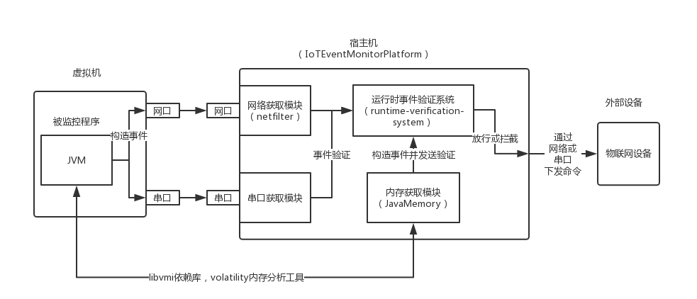

# IoTEventMonitorPlatform
物联网事件监控平台系统

# conf
    - gui_conf.xml 页面配置
    - gui_conf_default.xml 默认页面配置
# output
仅在构建后生成，包含输出的可执行文件
# src
    - GUI 图形界面部分，使用QT5编写
    - manager 后台线程，收集事件、验证事件
    - netfilterClient 使用netlink与内核netfilter作事件交互
    - serialPortClient 串口中继器，从串口获取事件
    - tinyxml2 开源的xml解析工具
    - verification 事件验证模块
        - rvsDFAInterface 状态机抽象接口
        - rvsDFA 具体的状态机

# IOT系统整体结构

# 环境搭建

## 宿主机端

1. **安装jdk 1.7**
    - http://blog.csdn.net/gatieme/article/details/52723931
2. **安装IntelliJ IDEA**
3. **导入工程 EventSimulation4Java**
    - 选择maven 确保lib目录下的jar包导入到工程中
    - 修改DEFAULT_SERVER_IP，保证可以与该Server正常通信
    - 构建工程 File-Project Structure-Artifacts - “+” - JAR - Create JAR from Modules - Main Class
    - 在Project选项卡中选择 EventSimulation Directory for META—INF改为/home/kong/EventSimulation4Java/src 删掉/main/java
    - Build  Build - Build Artifasts - Build
   File - Project Structure - Libraries - "+" - Java - linux_x64.jar
    - 编译后会在项目根目录下生成out文件夹 其中包含EventSimulation4Java.jar
    - 然后将整个工程文件夹发送到虚拟机中

4. **安装CLion 安装CMake**
5. **安装z3**
    - https://github.com/Z3Prover/z3
6. **安装Git**
    - 并配置 参考廖学锋Git教程
7. **需要clone的工程有：**
    - IoTEventMonitorPlatform ----- 分支linux
    - runtime-verification-system - 分支master
    - tinyxml2 -------------------- 分支cpys
    - tinylog  -------------------- 分支master
    - netfilter ------------------- 分支develop
    - mxGraph --------------------- 分支master http://github.com/cpys/mxGraph.git

    - 各工程需要注意cmakelists中的路径，编译选项均为 build all
    - 编译顺序为 tinyxml2 -- tinylog -- runtime-verification-system -- IoTEventMonitorPlatform
    - 编译tinyxml2/tinylog/runtime-verification-system 会在lib中生成so文件
    - 编译IoTEventMonitorPlatform时 header - NetfilterConf - 中的路径需要改为 netfilter工程的路径

8. **IoTEventMonitorPlatform** 需要权限运行 可以选择
    - sudo运行 CLion sudo sh clion.sh
    - sudo 运行 IoTEventMonitorPlatform
9. **内核模块相关命令**
    - insmod 模块名.ko ---- 安装模块
    - dmesg  ------------- 查看安装的内核模块
    - rmmod 模块名 -------- 删除模块
10. **安装KVM**
    - http://blog.leanote.com/post/alphajx/9358f12428ff
11. **在KVM中安装虚拟机**
    - 使用镜像ubuntu.img
12. **设置虚拟机为桥接模式**
    - http://blog.csdn.net/chenhaifeng2016/article/details/78162759
13. **给虚拟机添加串口**
    - 显示硬件详情 - 添加硬件 - Serial - Device - Psuedo TTY(pty)
14. **串口环境配置**
    - 宿主机端（Ubuntu系统）
        - 安装Cutecom工具：sudo apt-get install cutecom
        - 插串口线
    - 外部设备端（如windows系统）
        - 安装usb转串口驱动
        - 安装串口调试工具
    - Cutecom 和 调试工具配置相同的波特率、数据位、停止位等参数
    - 通过互相发送消息验证串口是否可用
## 虚拟机端 
- (可在宿主机中 ssh连接 命令为：ssh 虚拟机用户名@虚拟机ip）
1. 安装JDK
    - 拷贝java memory中的jdk文件夹 确保jdk为1.7
	可能添加源的方式行不通，使用解压方式
2. 从宿主机中传送过来的文件夹EventSimulation4Java中，进入到EventSimulation4Java.jar所在目录
    - 执行命令 sudo java -Djava.library.path=../../../lib/mfz-rxtx-2.2-20081207-linux-x86_64/ -jar -Xint EventSimulation4Java.jar

    - sudo ./java -Djava.library.path=/home/kong/IdeaProjects/EventSimulation4Java/lib/mfz-rxtx-2.2-20081207-linux-x86_64 -jar -Xint /home/kong/IdeaProjects/EventSimulation4Java/out/artifacts/EventSimulation4Java_jar/EventSimulation4Java.jar

3. 运行EventSimulation程序
    - 如果错误提示 “没有清单主属性” 说明jar包打包有问题
    - 如果错误提示 包含library.path 说明动态链接库路径有问题
    - 如果错误提示 Exception in thread "main" java.lang.NoClassDefFoundError: gnu/io/UnsupportedCommOperationException 将 lib/mfz-rxtx-2.2-20081207-linux-x86_64/下的
        - Copy RXTXcomm.jar ---> <JAVA_HOME>/jre/lib/ext
        - Copy librxtxSerial.so ---> <JAVA_HOME>/jre/lib/x86_64/
        - Copy librxtxParallel.so ---> <JAVA_HOME>/jre/lib/x86_64/

## 监控平台配置
1. 虚拟机ip字面意思
2. 外部设备ip指 接受平台验证数据后的一方 需要与EventSimulation4Java/src/main/java/Net/NetEventSend.java 中的DEFAULT_SERVER_IP 相同
默认为10.108.164.222(这个IP应该访问不到了，请务必修改，否则netfilter会抓不到数据包！！！)
3. KVM伪终端指 虚拟机模拟串口的设备名 形如/dev/pts/19
4. 宿主机串口名称指 宿主机串口名字，需要另外一台设备与宿主机用串口线相连 可用工具cutecom测试
5. 状态机文件选择 需要选择状态机相关的xml文件 
    - xml文件可以用mxGraph打开 mxGraph下载 git clone mxGraph http://github.com/cpys/mxGraph
    - ant grapheditor 构建mxGraph工程 根据提示的网址访问
6. mxGraph中打开的状态机图
    - 需要有开始节点和结束节点 被指针指向的为开始节点 双环的节点为结束节点
    - 如果加载的状态机图 没有开始结点或者结束节点 会导致客户端宕机
    - 推荐使用目录runtime-verification-system/examples/中的simple-model.xml先做测试

